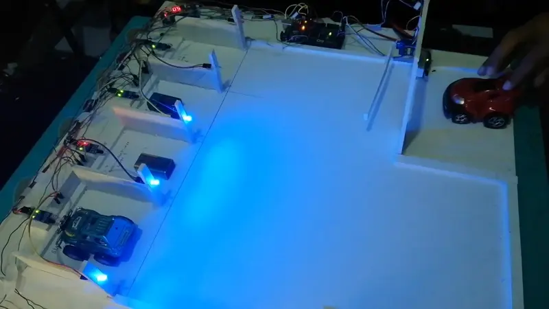

# automatic-parking-slot

# project glimpse

The project implements an automated parking management system using Arduino microcontrollers, IR sensors for vehicle detection, LED displays for status indication, and servo motors for gate control. The system shows red alerts when all parking slots are filled and prevents new vehicles from entering until a space becomes available. Individual occupied spaces are indicated with blue lights. The system can be extended with software solutions to handle payment processing and remote monitoring, creating a comprehensive parking management solution that reduces the need for human intervention.